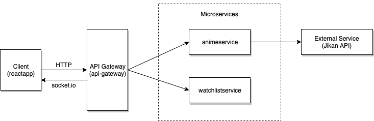
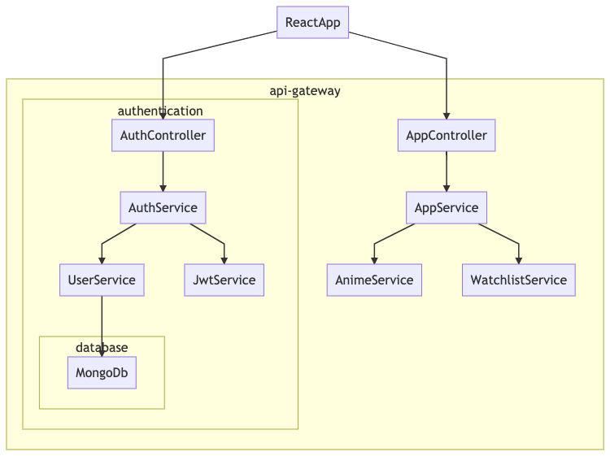
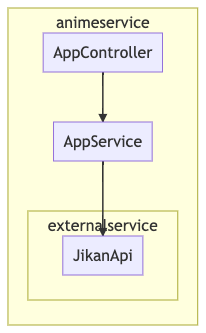
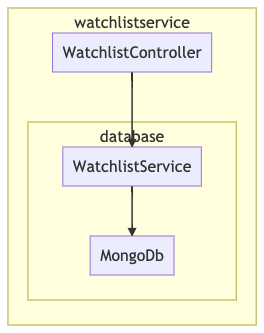

# microservices-nestjs-animelist

## Features

An anime watchlist manager app for demonstrating microservices architecture with NestJs.
It allows for:
- sign-up and login
- search for any animes and add them to your watchlist
- edit / update / remove animes from watchlist

## Application architecture

The system consists of the 3 following sub-projects:
- `animeservice` microservice
- `watchlistservice` Microservices
- `api-gateway` NestJS standalone app
- `reactapp` ReactJS client

## Technologies used:

- Message-based and Event-based microservices on redis:6379
- REST api on port HTTP:8080
- WebSocket (socket.io) on port ws:8081
- Docker - Docker Compose
- MongoDb - MongoDB Atlas
- NestJS - Api Gateway and microservices
- React app running on http://localhost:3000

## Diagrams

##### System diagram

##### Api Gateway Mermaid diagram

##### Anime Service Mermaid diagram

##### Watchlist Service Mermaid diagram


## Design Patterns

This architecture implements the following Microservice Design Patterns:

1. [Microservice Architecture](https://microservices.io/patterns/microservices.html)
2. [Subdomain Decomposition](https://microservices.io/patterns/decomposition/decompose-by-subdomain.html)
3. [External Service Api integration](https://jikan.moe/)
4. [Event Based and Message based communication](https://docs.nestjs.com/microservices/basics)
5. [API Gateway](https://microservices.io/patterns/apigateway.html)

## Layers

### API Layer

[NestJS](https://nestjs.com/) acts as the API Layer for the architecture. It takes care of listening for client requests and calling the appropriate back-end microservice to fulfill them.

### Microservice Layer

[redis](https://docs.nestjs.com/microservices/redis) was chosen as the framework to do the microservices. The Redis transporter implements the publish/subscribe messaging paradigm and leverages the Pub/Sub feature of Redis.
### Persistence Layer

MongoDB Atlas (cloud) is used as the database and Mongoose is used as an object modeling tool for MongoDB. The project uses a single database (MongoDB) instance for all microservices. The preffered way would be to have separate databases for each microservice.

## Deployment

Deployment is done with containers in mind. `docker-compose.yml` file along with Dockerfiles for each project have been created to run the whole thing on any machine. 

## Project structure

```
.
├── animeservice
│   ├── src
│   │   ├── app.controller.ts
│   │   ├── app.module.ts
│   │   ├── app.service.ts
│   │   └── main.ts
│   ├── Dockerfile
│   ├── nest-cli.json
│   └── package.json
├── api-gateway
│   ├── src
│   │   ├── authentication
│   │   ├── user
│   │   ├── app.controller.ts
│   │   ├── app.module.ts
│   │   ├── app.service.ts
│   │   ├── main.ts
│   │   └── util.ts
│   ├── Dockerfile
│   ├── nest-cli.json
│   └── package.json
├── images
├── reactapp
│   ├── public
│   ├── src
│   │   ├── components
│   │   ├── contexts
│   │   ├── utils
│   │   ├── App.js
│   │   ├── anime_girl.png
│   │   ├── appStyles.scss
│   │   ├── index.js
│   │   └── styles.scss
│   ├── Dockerfile
│   ├── README.md
│   └── yarn.lock
├── watchlistservice
│   ├── src
│   │   ├── watchlist
│   │   ├── app.module.ts
│   │   ├── main.ts
│   │   └── util.ts
│   ├── test
│   ├── Dockerfile
│   ├── nest-cli.json
│   └── yarn.lock
├── README.md
├── docker-compose.yml
└── project-structure-tree.txt
```

## Launch app

- Run app in docker container:

#### `docker network create infrastructure && docker-compose up -d`

- In case missing docker, run Redis Server locally first:
##### `redis-server`
Then run each subproject individually with:
##### `yarn install`
##### `yarn run start:dev`